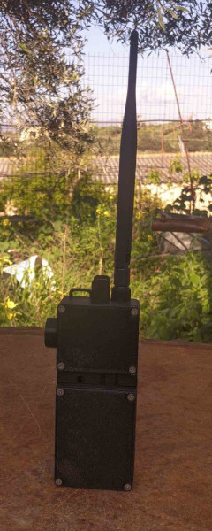
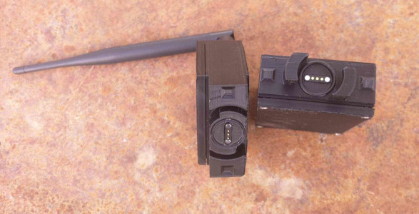
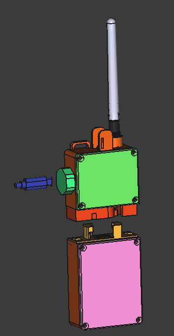
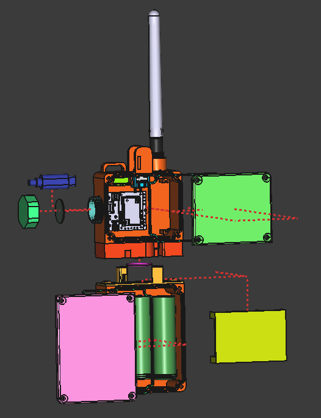
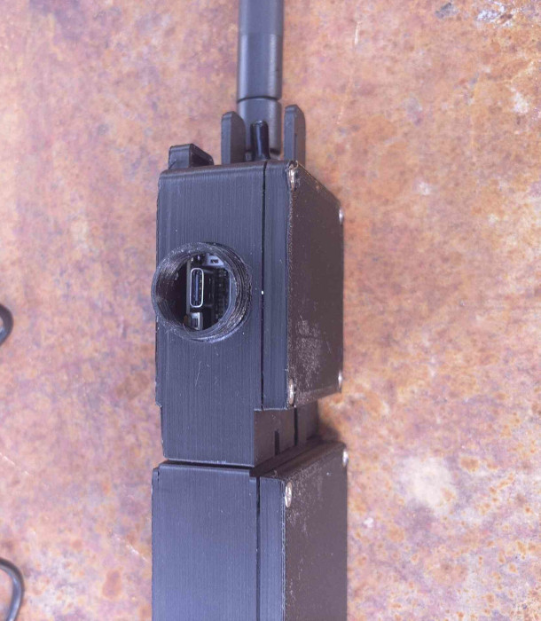
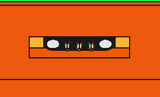
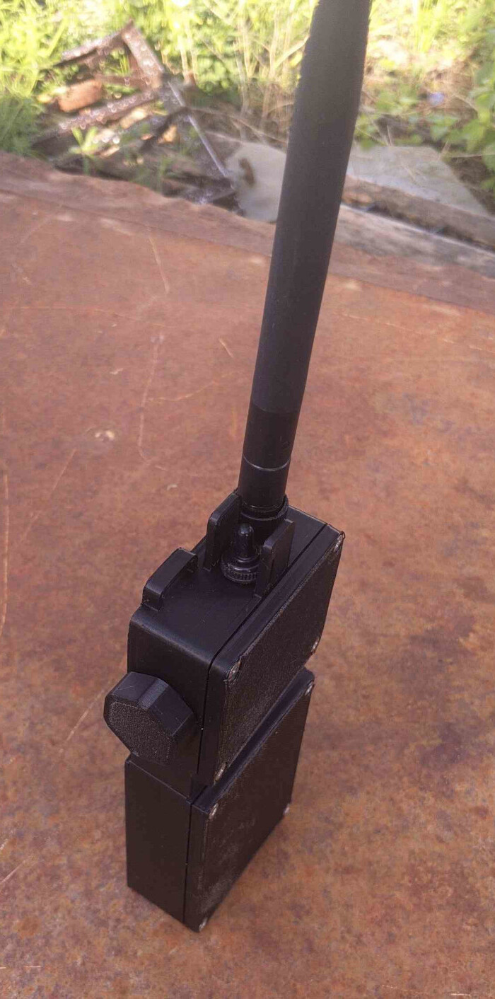

# NomadShell: A Parametric, Waterproof Enclosure for Meshtastic Modules

**NomadShell** is a rugged, parametric enclosure designed specifically for Meshtastic deployments in harsh environments. It provides a secure, weather-resistant housing for **RAKwireless WisBlock** components and is ideal for off-grid, portable communication nodes.

 

Battery connect-disconnect 

## Core Compatibility

NomadShell is engineered to fit the following modules:

- [RAK19003 WisBlock Base Board](https://docs.rakwireless.com/product-categories/wisblock/rak19003/overview/)
- [RAK4631 LoRaWAN Module](https://docs.rakwireless.com/product-categories/wisblock/rak4631/overview/)
- [RAK12500 GNSS Module](https://store.rakwireless.com/products/wisblock-gnss-location-module-rak12500)

---

## Power System

The system is powered by **three 18650 Li-ion batteries in parallel**, providing long-lasting operation in the field.  
The batteries are housed in a dedicated battery compartment for easy maintenance and swapping.

---

## Modular Design

NomadShell is composed of two main parts:

- **Main electronics housing** (RAK modules)
- **Battery compartment** (3x18650 cell pack)

These components are joined using a **3-pin magnetic pogo connector**, enabling reliable electrical contact and quick assembly/disassembly.  
An **O-ring seal** around the interface ensures additional water resistance, making the enclosure suitable for outdoor use in challenging conditions.

---

## Weather Resistance

Designed with field deployment in mind, NomadShell includes:

- Water-resistant seals
- Durable materials
- Magnetic modularity

Perfect for hikers, adventurers, remote IoT setups, and emergency mesh communication networks.

---

## Use Cases

- Off-grid Meshtastic communication nodes
- Field-deployable GPS+LoRa devices
- Environmental monitoring
- Emergency mesh setups

# Design with Freecad
The design was performed with FreeCAD_weekly-builds-40006. All the variables are location on the VarSet. 

## Change module

The pcb stand-offs can be changed from the sketch: main_body-> main_body001->pcb_standoff001, so you can change the type of the module used. The USB-C opening can be changed on the sketch: main_body-> main_body001->usb_cap

# Assembly  
Between the base and the cover is a gasket, printed with TPU(PrimaSelect TPU 64D). All the other parts are printed with PLA. A small portion of black hot glue or 2 part epoxy is needed to placed behind the pogo pins to stop water from getting inside the battery and main case. 

The [usb_cover_base](./3mf/usb_cover_base.3mf) needs to be glued on the the main body.  

The central pin of the magnetic pogo pin will be connected to GND and the 2 outer ones on the 3.3V. The battery can be connected on frond and backwards.

Use the [instalation_tool_pogopins](./3mf/instalation_tool_pogopins.3mf) to install the magnetic pogo pins.

A small drop of glue is needed to be placed on the o-ring used between the main and battery part. The orion is better to be glued on battery part.

## Needed hardware:
- 8x M3x15mm machine/countersink
- 8x M3 nuts
- 1x O-ring Diameter:17.2mm, Cross Section: 1.8mm 
- 1x SP3T ON-OFF-ON 3A/250VAC (6mm) switch to change it: main_body-> main_body001-> switch_antennas. [example](https://grobotronics.com/toggle-switch-on-off-on-sp3t-3a-250v.html)
- 1x Weatherproof Cover for Toggle Switch - Ø6mm [example](hhttps://grobotronics.com/toggle-switch-cover-6mm-waterproof.html)
- 1x set of Magnetic Pogo Pin. Set diamention on VarSet: pogopins_r, and pogoping_lenght

# Photos

## License

Copyright (c) 2024 Kostas Gompakis

Licensed under the MIT license.